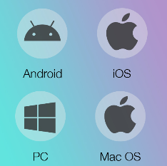
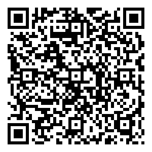
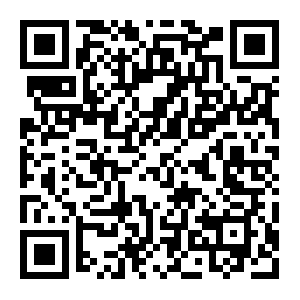

.. _0_prepartion:

0.Prepartion
==================

We need to prepare
------------------

1. Raspberry PI 4/5
2. three 18650 batteries 
3. SD card
4. card reader

The above parts are not included in the kit.

We first carry out the system burning of the car and the configuration of related 
Settings, you can see the details in this chapter.
  
* :ref:`system_burning&configuration`

After that, we started to assemble our car. Here we provide a detailed assembly 
video, which can be viewed in the following chapter.

* :ref:`assemble_smart_car`

Next we installed our platform client, which communicates with our Raspberry PI 
car, transmits video streams, and sends commands to control the Smart car.

* :download:`Android <https://github.com/lafvintech/RaspberryPICar/releases/download/v1.0.0/RaspPICar.apk>`
* :download:`Windows <https://www.dropbox.com/scl/fo/o1rbv33e6cm72bizreh8v/ALHQdUU-NBrsDn_AbMX1VxI?rlkey=0fyzzuwurngelni7mpqjmjrqh&st=ghp7r003&dl=1>`
* :download:`IOS   <https://apps.apple.com/us/app/rasppicar/id6738298527?platform=iphone>`
* :download:`Macos <https://apps.apple.com/us/app/rasppicar/id6738298527?platform=mac>`

   Android App

   iOS App

.. .. raw:: html

..    <iframe width="560" height="315" src="https://www.youtube.com/embed/RiYnucfy_rs?si=82wZxz8_AiiZomA2" title="YouTube video player" frameborder="0" allow="accelerometer; autoplay; clipboard-write; encrypted-media; gyroscope; picture-in-picture; web-share" referrerpolicy="strict-origin-when-cross-origin" allowfullscreen></iframe>