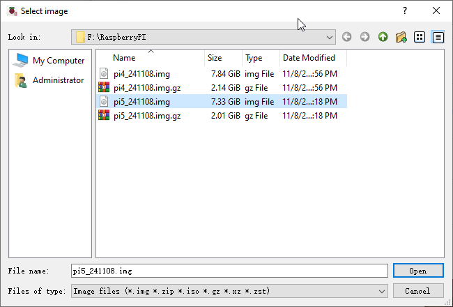

1 Software installation and Test (necessary)
==============================================

In this chapter, we will make some necessary preparation: start your Pi Raspberry 
and install some necessary libraries. Then test some parts. Batteries are needed when 
driving peripherals such as motors, servos, LEDs, etc.

.. note:: 
    
    1, Please use Raspberry Pi OS with Desktop 
    2, The installation of libraries takes much time. You can power Raspberry Pi with a power supply Cable. 
    3, If you are using remote desktop to login Raspberry Pi, you need to use `VNC viewer <https://www.realvnc.com/en/connect/download/viewer/>`_ 

Step 1 Obtain the Code and Set python3 as Default
--------------------------------------------------

To download the code, you can power Raspberry Pi with a power supply cable or switch 
on S1 (Power Switch). Then open the Raspberry Pi and the terminal. You can open 
the terminal by clicking as shown below, or you can press “CTRL + ALT + T” on the desktop.

.. image:: img/1/1.png
   :width: 600
   :alt: 1.png

The terminal is shown below:

.. image:: img/1/2.png
   :width: 600
   :alt: 2.png

Open the terminal and type the following commands to obtain the car code. And the 
code will be placed in the directory "Pi". (Note: Here are two commands. Please 
execute them in order.)

.. code-block:: shell
    
    cd 
    git clone https://github.com/

Downloading takes some time. Please wait with patience. You can also find and 
download the code by visiting our `official website <https://lafvintech.com/>`_  or 
our `github repository <https://github.com/lafvintech/RaspberrySmartCar>`_ . 
Please note that this tutorial is based on python3. If you want to use python2, 
please download another version of the tutorial.

Set Python3 as default python (Necessary)
-------------------------------------------
First, execute python to check the default python on your Raspberry Pi. Press Ctrl-Z to exit.

.. image:: img/1/x.png
   :width: 600
   :alt: x.png

If it is python3, you can skip this section. If it is python2, you need execute 
the following commands to set default python to python3.

1. Enter directory /usr/bin 
2. Delete the original python link. 
3. Create new python links to python. 
4. Check python. Press Ctrl-Z to exit. 

.. code-block:: shell
    
    cd /usr/bin
    sudo rm python
    sudo ln -s python3 python
    python

.. image:: img/1/x.png
   :width: 600
   :alt: x.png

If you want to set python2 as default python in other projects, just repeat the 
commands above and change python3 to python2.

**Shortcut Key**

1. Now, we will introduce several shortcuts that are very useful and commonly used in terminal.
up and down arrow keys. History commands can be quickly brought back by using up 
and down arrow keys, which are very useful when you need to reuse certain commands. 
When you need to type commands, pressing “↑” will go backwards through the history 
of typed commands, and pressing “↓” will go forwards through the history of typed command.

2.Tab key. The Tab key can automatically complete the command/path you want to 
type. When there are multiple commands/paths conforming to the already typed letter, 
pressing Tab key once won’t have any result. And pressing Tab key again will list 
all the eligible options. This command/path will be completely typed as soon as 
you press the Tab key when there is only one eligible option.

s shown below, under the ‘~’directory, enter the Documents directory with the 
“cd” command. After typing “cd D”, press Tab key, then there is no response. 
Press Tab key again, then all the files/folders that begin with “D” is listed. 
Continue to type the character "oc", then press the Tab key, and then “Documents” 
is completely typed automatically.

.. image:: img/1/x.png
   :width: 600
   :alt: x.png

.. image:: img/1/x.png
   :width: 600
   :alt: x.png

Step 2 Configuration
-----------------------
**Enable I2C and VNC**
The I2C interface Raspberry Pi is disabled by default. You need to open it manually.

.. image:: img/1/x.png
   :width: 600
   :alt: x.png

.. image:: img/1/x.png
   :width: 600
   :alt: x.png

Type a command to check whether the I2C module is enabled:

.. code-block:: shell

    lsmod | grep i2c

If I2C module has been enabled, the following content will show up (the numbers 
showing in your device may be different):

.. image:: img/1/x.png
   :width: 600
   :alt: x.png

**Install I2C-Tools**

Type the command to install I2C-Tools.

**Install python-smbus**

Python-smbus is a module of the program Python, which contains some classes and 
methods to operate I2C. Type the following command to install python-smbus:

.. code-block:: shell

    sudo apt-get install python3-smbus

Communication test 

The smart car board has two chips, PCF8591 and PCA9685. Their I2C addresses are 
0X48 and 0X40 respectively. Command “i2cdetect –y 1” can detect whether the board 
is successfully connected to Raspberry Pi.

.. code-block:: shell

    i2cdetect -y 1

.. image:: img/1/x.png
   :width: 600
   :alt: x.png

If an I2C device is connected to your RPI, its I2C address will be displayed here.

**Additional supplement**

Raspbery Pi, other than 4B and 400, needs to disable the audio module, othewise 
the LED will not work properly.

1. Create a new snd-blacklist.conf and open it for editing

sudo nano /etc/modprobe.d/snd-blacklist.conf

Add following content: After adding the contents, you need to press Ctrl+O, Enter, Ctrl+Z.

.. code-block:: shell

    blacklist snd_bcm2835

2. We also need to edit config file.

.. code-block:: shell

    sudo nano /boot/config.txt

Find the contents of the following two lines (with Ctrl + W you can search):

.. code-block:: shell

    # Enable audio (loads snd_bcm2835) 
    dtparam=audio=on

Add # to comment out the second line. Press Ctrl+O, Enter, Ctrl+X

.. code-block:: shell

    # Enable audio (loads snd_bcm2835) 
    # dtparam=audio=on

.. image:: img/1/x.png
   :width: 600
   :alt: x.png

It will take effect after restarting, and you can restart after executing the 
next section. If you want to restart the audio module, just restore the content 
modified in the above two steps.

Step 3 Run the Libraries Installation Program
------------------------------------------------

1. Execute following commands to enter directory of “[setup.py](http://setup.py/)”.

.. code-block:: shell

    cd ~/Freenove_4WD_Smart_Car_Kit_for_Raspberry_Pi/Code

1. Run setup.py

.. code-block:: shell

    sudo python setup.py

This program will automatically install the pca9685, rpi_ws281x, PyQt5 library, 
etc. Please reboot the Raspberry Pi after the installation is completed, as shown 
below.

.. image:: img/1/x.png
   :width: 600
   :alt: x.png

If the installation fails, please rerun setup.py. After the installation is completed, 
restart the Raspberry Pi. Most installation failures are caused by network reasons.

.. code-block:: shell

    sudo python setup.py

