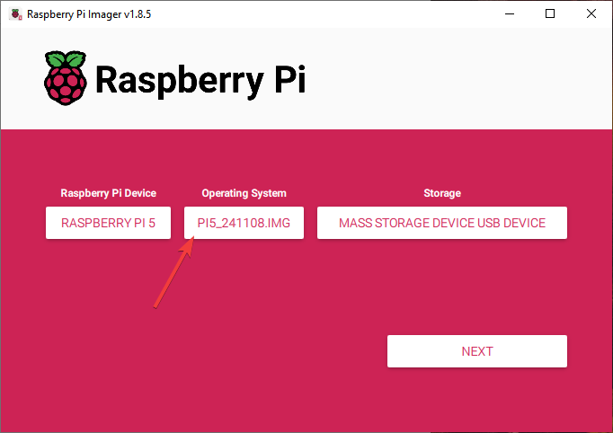
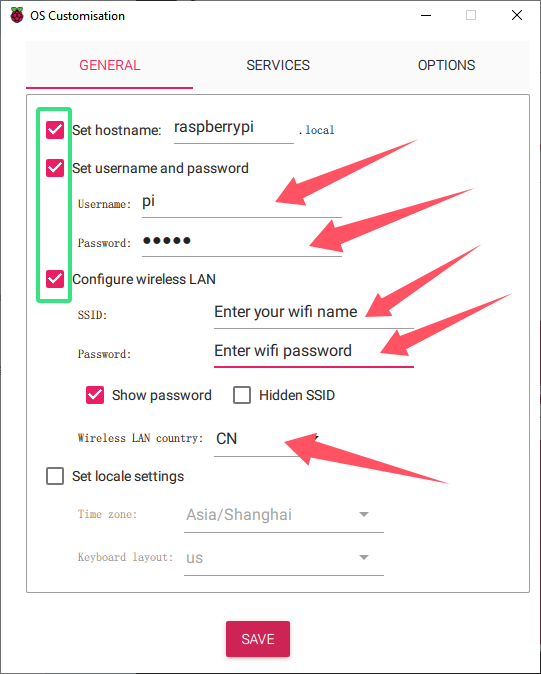

.. _system_burning&configuration:

1.System Burning&Configuration
===============================

**Step 1 Download the burning tool**
--------------------------------------

Raspberry Pi have developed a graphical SD card writing tool that works on Mac OS, Ubuntu 18.04 and Windows, and is the easiest option for most users as it will download the image and install it automatically to the SD card.

Visit the `Raspberrypi Imager <https://www.raspberrypi.org/software/>`_. Click on the link for the **Raspberry Pi Imager** that matches your operating system, when the download finishes, click it to launch the installer.

.. image:: ./img/1/software1.png

**Step 2 Download system image**
--------------------------------------

When you launch the installer, your operating system may try to block you from running it. For example, on Windows I receive the following message:

If this pops up, click on **More info** and then **Run anyway**, then follow the instructions to install the Raspberry Pi Imager.

.. image:: ./img/1/sofeware2.png

We also need to download the corresponding .img system image package, which we can 
download at this website.

According to your Raspberry PI model download, we currently offer Raspberry PI 4 
and 5 image files.

* :download:`RPI4 Image <https://www.dropbox.com/scl/fo/qy1pb2digre7kc61toi0o/AA42Ij0n_alPvPB30meBeHM?rlkey=rovnde819ihtsy0ru4c0zmch1&e=1&st=r5evhc7n&dl=1>`

* :download:`RPI5 Image <https://www.dropbox.com/scl/fo/knr2xdx82oe09vwejbt3x/AEy2A2zeRxKYPPgWmPUAFPE?rlkey=94adhnmnzr9plse5abl5of68a&e=1&st=ri27qa4f&dl=1>`

:ref:`unzip` 

**Step 3 Insert the SD card into the card reader and computer**
----------------------------------------------------------------------------

Insert the SD card into the card reader and plug it into the usb port of your computer.

**Step 4 Select SD card and image**
--------------------------------------

Select your Raspberry PI model in the burning software, and select the operating 
system of the corresponding img package you just downloaded.

.. image:: ./img/1/3.png

Select the SD card you are using.

It should end up looking something like this.

**Step 5 Configure burn Settings**
--------------------------------------

Press **Ctrl+Shift+X** or click the **setting** icon to open the **Advanced options** page to enable SSH and set username and password.

.. warning::
   - Now that the Raspberry Pi doesn't have a default password, you will need to set it yourself. Also, the username can be changed.
   - For remote access, you will also need to enable SSH manually.
   - You need to enter the Wi-Fi name and password in "Configure wireless LAN," and also set the Wi-Fi country, otherwise, you won't be able to connect to the internet.

**Wireless LAN country** should be set the two-letter `ISO/IEC alpha2 code <https://en.wikipedia.org/wiki/ISO_3166-1_alpha-2#Officially_assigned_code_elements>`_ for the country in which you are using your Raspberry Pi.

Then scroll down to complete the wifi configuration and click **SAVE**.

**Step 6**
--------------------------------------

When asked "Would you like to apply OS customisation settings?", press "YES".

.. image:: ./img/1/image17.png

**Step 7**
--------------------------------------

If your SD card currently has any files on it, you may wish to back up these files first to prevent you from permanently losing them. If there is no file to be backed up, click **Yes**.

.. image:: ./img/1/image18.png

**Step 8 Burn completion**
--------------------------------------

After waiting for a period of time, the following window will appear to represent the completion of writing.

Need Help?
------------

**tech_edu_service@outlook.com**