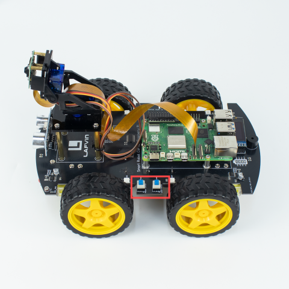
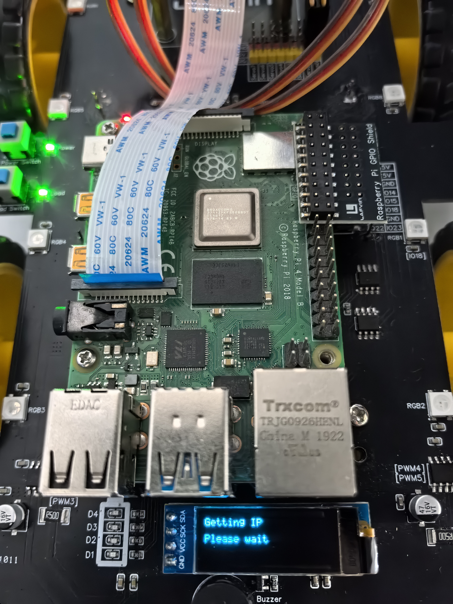
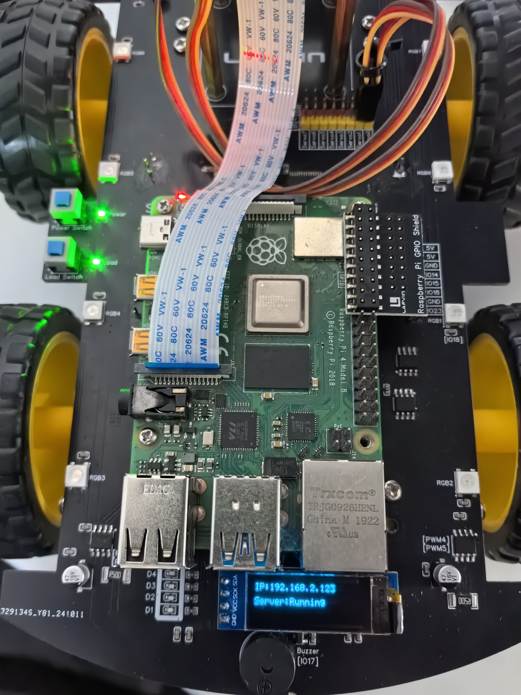

.. _assemble_smart_car:

2.Assemble Smart Car
======================

.. raw:: html
   
   <iframe width="560" height="315" src="https://www.youtube.com/embed/4ASke1qjOh4?si=tZyeTam60YYdIGUH" title="YouTube video player" frameborder="0" allow="accelerometer; autoplay; clipboard-write; encrypted-media; gyroscope; picture-in-picture; web-share" referrerpolicy="strict-origin-when-cross-origin" allowfullscreen></iframe>

Or you can download the Installation Tutorial Video

* :download:`Installation Tutorial Video <https://www.dropbox.com/scl/fo/ssmlerkwngmcanppthnv3/AODY8U48EFLClQ6zifOcB0Q?rlkey=4oaaxui1fjmvun54rvuq1t73e&st=1ffnj664&dl=1>`

First, after ensuring that the system has been successfully burned, the WiFi is 
configured, and the small car is assembled, we can officially use the small car.

We install the Raspberry Pi small car with 3*18650 batteries and power it on. 
Note that when it is powered on for the first time, the small car needs to 
perform some initialization, and the OLED screen usually does not display at 
this time. You can wait for a minute, then press to turn off the power of the 
small car (the two buttons on the small car pop up), and then power it on again 
(the two buttons on the small car are pressed down).

After that, we should be able to see the OLED display normally.

Once we can see the OLED display as described above, it means the system has 
obtained an IP address, which is the normal behavior. If the system fails to 
obtain an IP address and the OLED screen displays **IP not found** please refer 
to the steps in the following section, specifically Step 5, to check your WiFi 
configuration during the burning process and re-burn the system if necessary.

* :ref:`system_burning&configuration`

.. image:: ./img/1/image15(1).png

Need Help? 
------------------

**tech_edu_service@outlook.com**
