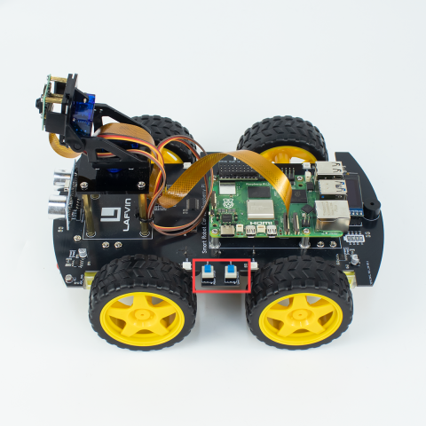
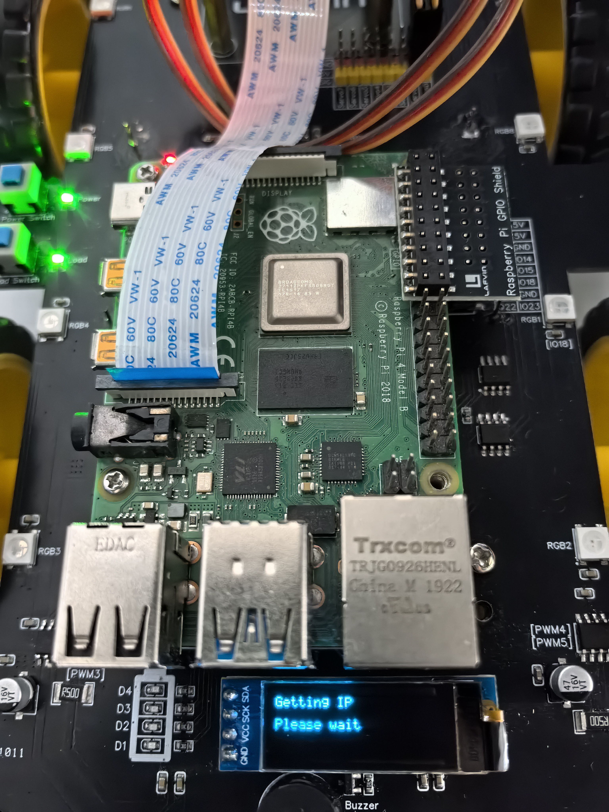
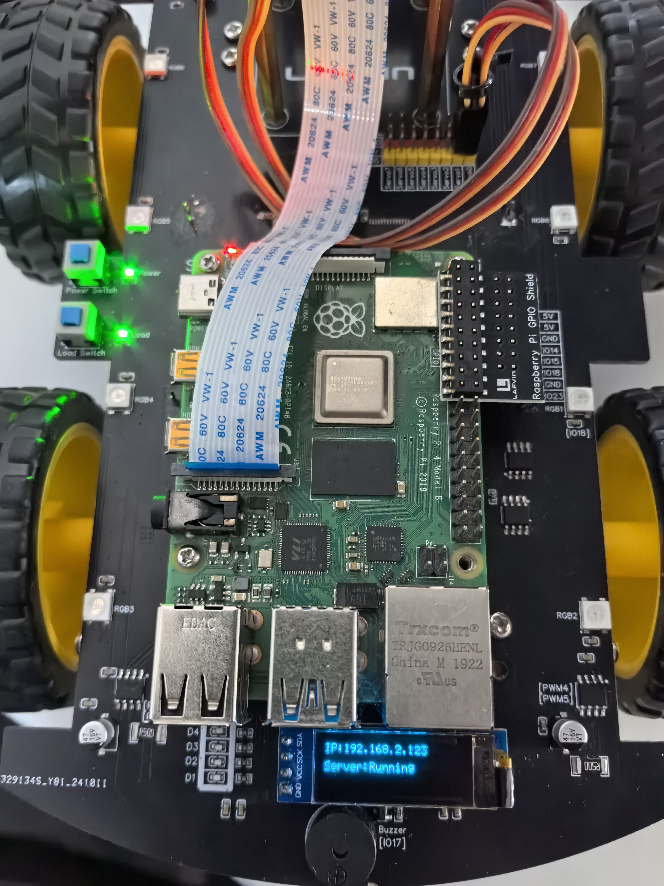
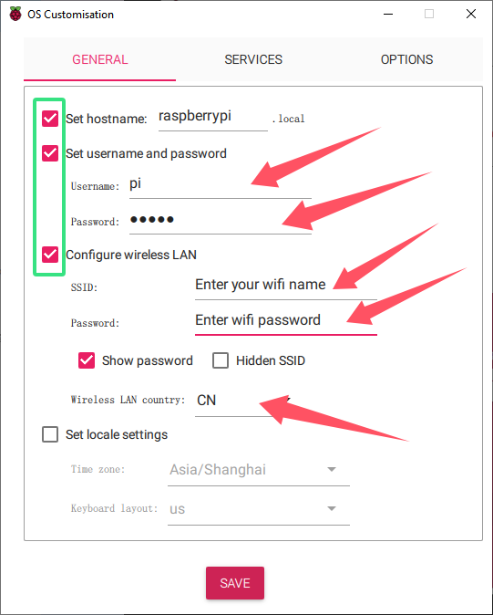

.. _assemble_smart_car:

2.Assemble Smart Car
======================

.. raw:: html
   
   <iframe width="560" height="315" src="https://www.youtube.com/embed/4ASke1qjOh4?si=tZyeTam60YYdIGUH" title="YouTube video player" frameborder="0" allow="accelerometer; autoplay; clipboard-write; encrypted-media; gyroscope; picture-in-picture; web-share" referrerpolicy="strict-origin-when-cross-origin" allowfullscreen></iframe>

Or you can download the Installation Tutorial Video

* :download:`Installation Tutorial Video <https://www.dropbox.com/scl/fo/ssmlerkwngmcanppthnv3/AODY8U48EFLClQ6zifOcB0Q?rlkey=4oaaxui1fjmvun54rvuq1t73e&st=1ffnj664&dl=1>`

First, after confirming that the system has been flashed successfully, Wi-Fi has
been configured, and the car has been assembled, you can power on the car and
start using it.

Install three fully charged 18650 batteries in the battery holder on the bottom
of the car, making sure the polarity is correct. Then press the **Power Switch**
and **Load Switch** in order. This powers the baseboard, the Raspberry Pi, and
the connected load devices.

.. note::
   During the first startup after flashing, the Raspberry Pi needs time to
   initialize, so the OLED screen may remain blank at first. Wait about 2
   minutes, then use the **Power Switch** to turn the car off and on again.
   After the second startup, the OLED screen should display normally.

After that, you should see the OLED display working normally.

Once we can see the OLED display as described above, it means the system has 
obtained an IP address, which is the normal behavior. If the system fails to 
obtain an IP address and the OLED screen displays **IP not found** please refer 
to the steps in the following section, specifically Step 5, to check your WiFi 
configuration during the burning process and re-burn the system if necessary.

* :ref:`system_burning&configuration`

Need Help? 
------------------

**tech_edu_service@outlook.com**
