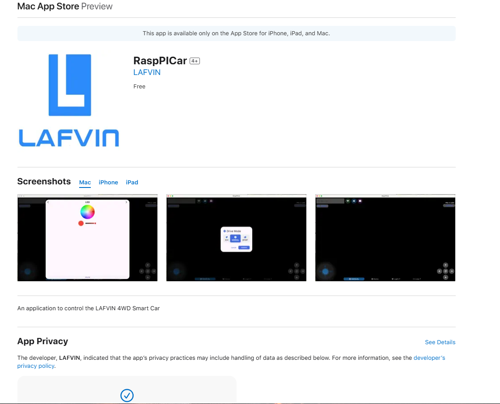
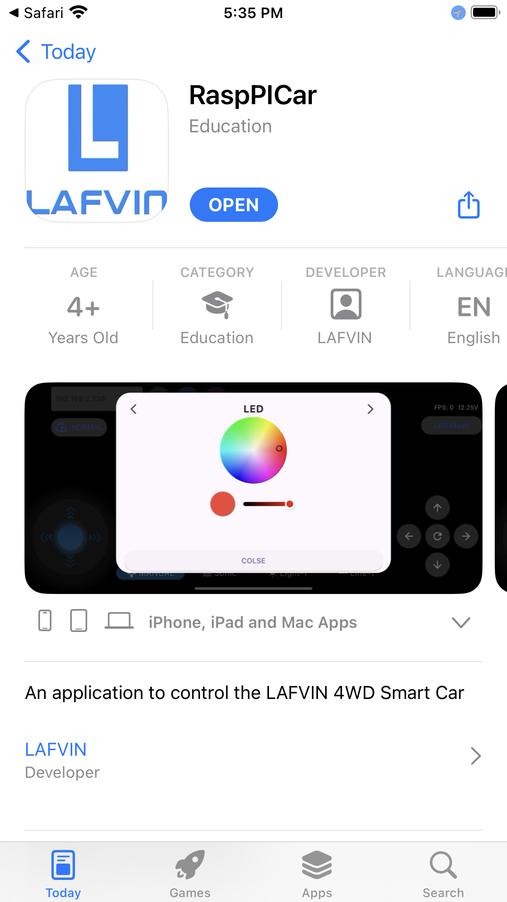
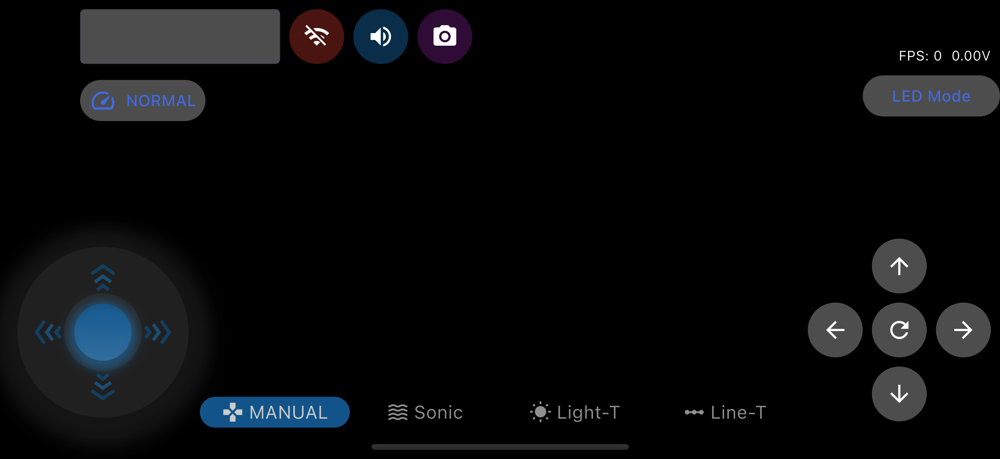
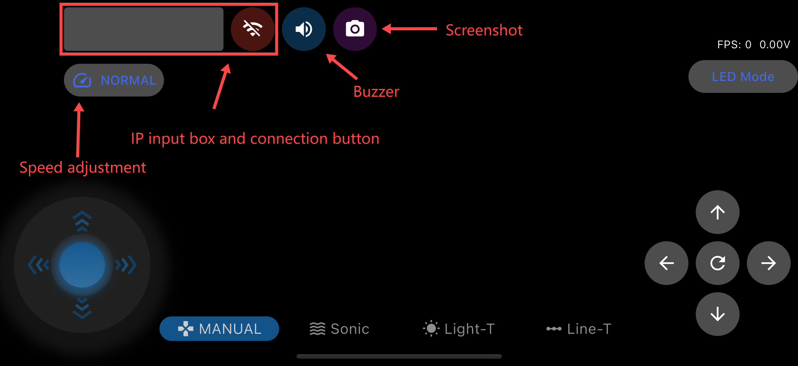
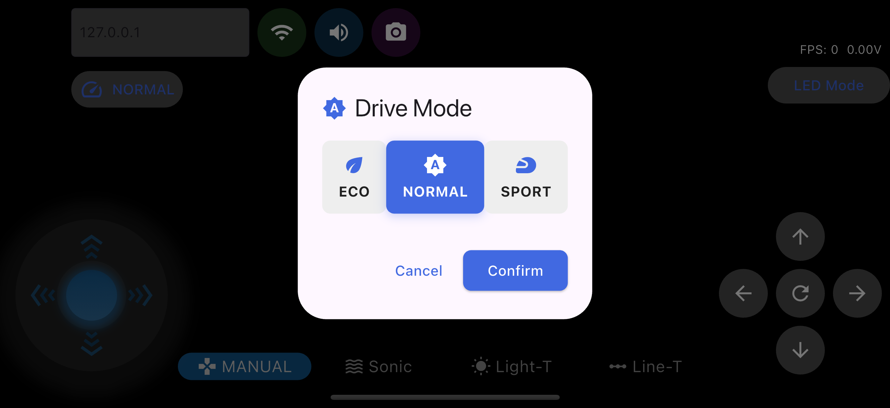
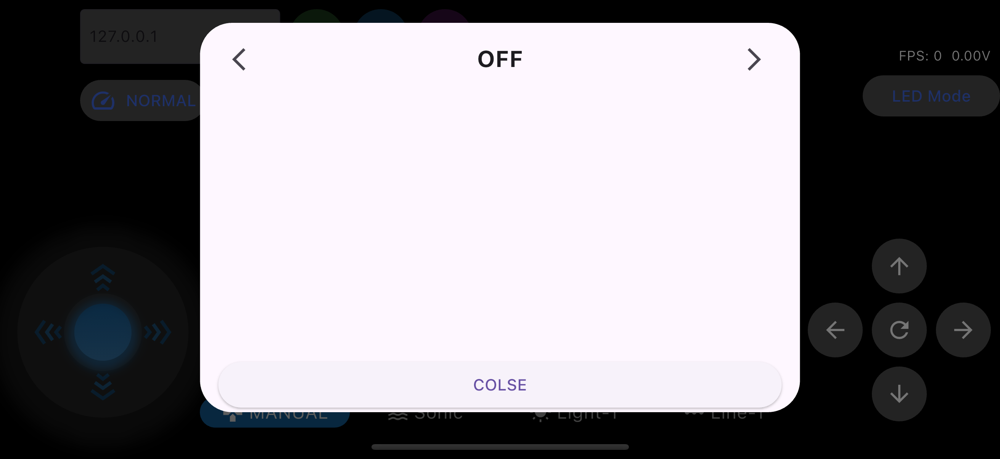
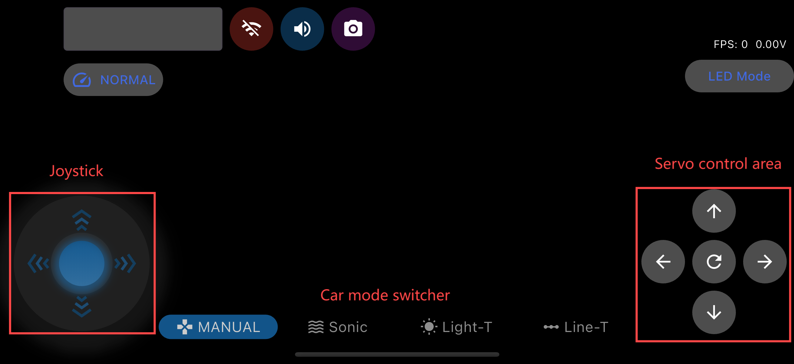

3.Smart Video Car
=================
The intelligent video car integrates all previous functions, including path following, 
light tracking, line tracking, ultrasonic obstacle avoidance, face detection, video 
transmission, and LED control.
It is driven by a server on the Raspberry Pi and can be remotely controlled within 
the local area network (LAN) using a computer or smart phone.

Server
------
The server operates on a Raspberry Pi, capable of transmitting data from cameras, 
ultrasonic sensors, and other sensors back to the client, as well as receiving 
commands from the client.

After you have finished burning the image we provided and configured the WiFi, you 
insert the SD card into the Raspberry Pi, install the battery, and power it on. The 
server will automatically start, and at this point, the OLED screen will display the 
current car's IP address.

You can then use your smartphone or computer to control it through the corresponding 
client.

Client
--------
The client connects to the server via TCP, receiving video streams and commands 
from the server, and can also send commands to the server to control the car. 
The client can run on different operating systems, including Android, Windows, 
iOS, and macOS. You can download it from the following four links respectively:

1. `Android <dropbox>`_
2. `Windows <dropbox>`_
3. `IOS   <https://apps.apple.com/us/app/rasppicar/id6738298527?platform=iphone>`_
4. `Macos <https://apps.apple.com/us/app/rasppicar/id6738298527?platform=mac>`_

After downloading and opening the app, you will see this interface:

In the top left corner is the IP input box and the connection button, on the right are some buzzer and screenshot buttons, and below are the speed adjustment buttons.

By clicking the speed adjustment button, you can select the three modes of the car.

The top right corner shows FPS and voltage information, and below is the LED light mode switch button.

.. image:: ./img/6/right_up.png

In the bottom left corner is the joystick, which controls the movement of the car. Directly below is the car's mode switch button, and in the bottom right corner is the servo control button.

