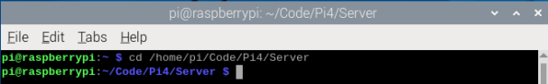
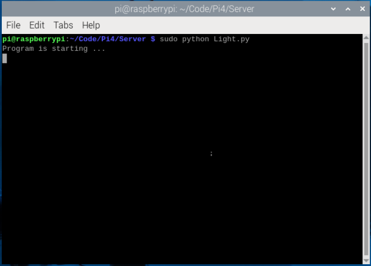

4.Light tracing Car
===================

Description
------------

The light-tracing function of the car mainly uses a photoresistor. The car has 
two photoresistors located on the left and right sides at the front to detect light

A photoresistor is a resistor based on the photoelectric effect of the semiconductor. 
The resistance changes with the intensity of the incident light. With the incident 
light intensity increasing, the resistance decreases.With the incident light intensity 
decreasing, the resistance increases.

And the change of the resistance value also causes voltage applied to the photoresistor 
changes. According to the change of voltage, the position of the light to the car 
will be detected, and then make the car move corresponding action to trace light.

Put your car in a darker environment.

.. note:: 

    Before running the standalone program, make sure to shut down the main program 
    ccording to the following sections; otherwise, the standalone program will not 
    be able to start.
    :ref:`VNC`

Run program
------------   
1. You can jump to the project folder directly by running this command:
``cd /home/pi/Code/Pi4/Server``

2. Run Light.py:
``sudo python Light.py``

You can press "Ctrl + C" to end the program

Details of the program
------------------------

.. code-block:: python
   :emphasize-lines: 2
   :linenos:

    import time
    from Motor import *
    from ADC import *

    class Light:
        def run(self):
            try:
                self.adc=Adc()
                self.PWM=Motor()
                self.PWM.setMotorModel(0,0,0,0)
                while True:
                    L = self.adc.recvADC(0)
                    R = self.adc.recvADC(1)
                    if L < 2.99 and R < 2.99 :
                        self.PWM.setMotorModel(800,800,800,800)
                    elif abs(L-R)<0.15:
                        self.PWM.setMotorModel(0,0,0,0)
                        
                    elif L > 3 or R > 3:
                        if L > R :
                            self.PWM.setMotorModel(-1200,-1200,1400,1400)
                            
                        elif R > L :
                            self.PWM.setMotorModel(1400,1400,-1200,-1200)
                        
            except KeyboardInterrupt:
            led_Car.PWM.setMotorModel(0,0,0,0) 

    if __name__=='__main__':
        print ('Program is starting ... ')
        led_Car=Light()
        led_Car.run()

Result Analysis
---------------
The car's movement is determined by the voltage readings from the photoresistors 
on the left and right sides. If both voltages are below 2.99V, the car will proceed 
in a straight line. However, if one of the voltages exceeds 3V, the car's direction 
will be adjusted as follows:

If the voltage on the left side is higher than the right, the car will make a 
left turn.
If the voltage on the right side is higher than the left, the car will make a 
right turn. By modifying the conditions in the program, you can tailor the car's 
behavior to suit the ambient light conditions.

.. image:: ./img/4/light.gif