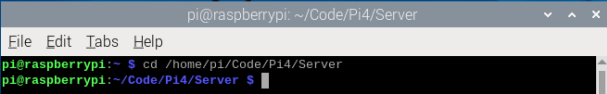
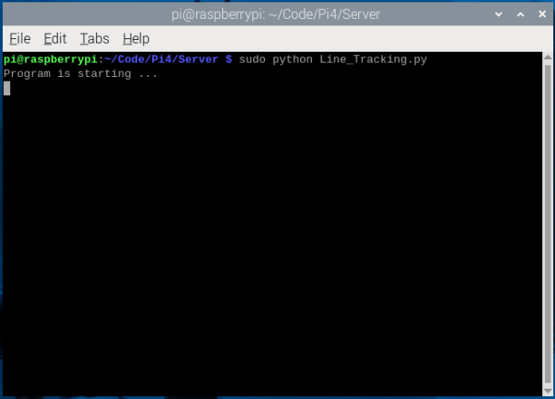

5.Infrared Line Tracking Car
==============================

Description
------------
The car's line following capability is implemented through three infrared sensors. 
Each sensor includes an LED indicator that illuminates upon detecting a black line. 
The car's movement control system responds to the combined input from these three 
sensors.

.. note:: 

    Before running the standalone program, make sure to shut down the main program 
    ccording to the following sections; otherwise, the standalone program will not 
    be able to start.
    :ref:`test_subroutine`

.. note:: 

    If you need to operate the tracking function normally, before running the program, 
    you need to use the black tape included with the kit to paste a path with two tape 
    widths on the ground or a flat surface. This way, the tracking sensor can recognize 
    it properly.

Run program
------------   
1. You can jump to the project folder directly by running this command:
``cd /opt/Code/Pi4/Server`` or ``cd /opt/Code/Pi5/Server-pi5``

2. Run Light.py:
``sudo python Line_Tracking.py``

You can press "Ctrl + C" to end the program

Details of the program
------------------------

.. code-block:: python
   :emphasize-lines: 2
   :linenos:
   
    import time
    from Motor import *
    import RPi.GPIO as GPIO

    class Line_Tracking:
    def __init__(self):
        # Define GPIO pins for three infrared sensors
        self.IR01 = 14    # Left sensor
        self.IR02 = 15    # Middle sensor 
        self.IR03 = 23    # Right sensor
        # Set GPIO mode and configure pins as inputs
        GPIO.setmode(GPIO.BCM)
        GPIO.setup(self.IR01,GPIO.IN)
        GPIO.setup(self.IR02,GPIO.IN)
        GPIO.setup(self.IR03,GPIO.IN)

    def run(self):
        while True:
            # Initialize sensor state variable
            self.LMR=0x00
            # Read sensors and update state using bitwise operations
            if GPIO.input(self.IR01)==True:    # If left sensor detects line
                self.LMR=(self.LMR | 4)        # Set bit 2 (binary 100)
            if GPIO.input(self.IR02)==True:    # If middle sensor detects line
                self.LMR=(self.LMR | 2)        # Set bit 1 (binary 010)
            if GPIO.input(self.IR03)==True:    # If right sensor detects line
                self.LMR=(self.LMR | 1)        # Set bit 0 (binary 001)
            
            # Control car movement based on sensor states
            if self.LMR==2:      # Only middle sensor detects line (010)
                PWM.setMotorModel(1000,1000,1000,1000)    # Move forward
            elif self.LMR==6:    # Left and middle sensors detect line (110)
                PWM.setMotorModel(-1100,-1100,1100,1100)  # Turn left slightly
            elif self.LMR==4:    # Only left sensor detects line (100)
                PWM.setMotorModel(-1300,-1300,1300,1300)  # Turn left sharply
            elif self.LMR==3:    # Middle and right sensors detect line (011)
                PWM.setMotorModel(1100,1100,-1100,-1100)  # Turn right slightly
            elif self.LMR==1:    # Only right sensor detects line (001)
                PWM.setMotorModel(1300,1300,-1300,-1300)  # Turn right sharply
            elif self.LMR==0:    # No sensor detects line (000)
                PWM.setMotorModel(0,0,0,0)     # Stop
            elif self.LMR==7:    # All sensors detect line (111)
                PWM.setMotorModel(0,0,0,0)     # Stop

    # Create instance of Line_Tracking class
    infrared=Line_Tracking()

    # Main program logic follows:
    if __name__ == '__main__':
    print ('Program is starting ... ')
    try:
        infrared.run()    # Start line tracking
    except KeyboardInterrupt:  # When 'Ctrl+C' is pressed, stop the car
        PWM.setMotorModel(0,0,0,0)
    except Exception as e:    # Handle other exceptions
        print(f'An error occurred: {e}')
    finally:    # Ensure motor stops in any case
        PWM.setMotorModel(0,0,0,0)
        print('Motor model has been set to stop state.')

Result Analysis:
----------------
The line tracking car uses three infrared sensors to detect black lines and performs different movements based on different sensor combinations:

1. When middle sensor detects line (LMR = 2):
   - Indicates car is correctly centered on the line
   - The car moves forward straight (setMotorModel(1000, 1000, 1000, 1000))

2. When left sensors detect line (LMR = 4 or 6):
   - LMR = 4: Only left sensor detects, indicating significant rightward drift
   - The car makes a sharp left turn (setMotorModel(-1300, -1300, 1300, 1300))
   - LMR = 6: Left and middle sensors detect, indicating slight rightward drift
   - The car makes a gentle left turn (setMotorModel(-1100, -1100, 1100, 1100))

3. When right sensors detect line (LMR = 1 or 3):
   - LMR = 1: Only right sensor detects, indicating significant leftward drift
   - The car makes a sharp right turn (setMotorModel(1300, 1300, -1300, -1300))
   - LMR = 3: Right and middle sensors detect, indicating slight leftward drift
   - The car makes a gentle right turn (setMotorModel(1100, 1100, -1100, -1100))

4. When no line is detected (LMR = 0) or all sensors detect line (LMR = 7):
   - Indicates either line is lost or car is at intersection
   - The car stops (setMotorModel(0, 0, 0, 0))

Through this control strategy, the car can:
- Maintain accurate line following
- Make appropriate adjustments based on drift direction
- Vary turning intensity based on deviation amount
- Handle different line following scenarios effectively
- Stop safely when line is lost or at intersections

.. image:: ./img/5/line.gif

Need Help?
------------------

**tech_edu_service@outlook.com**