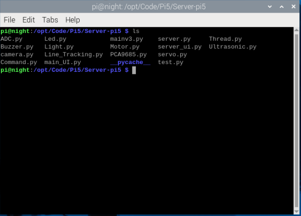
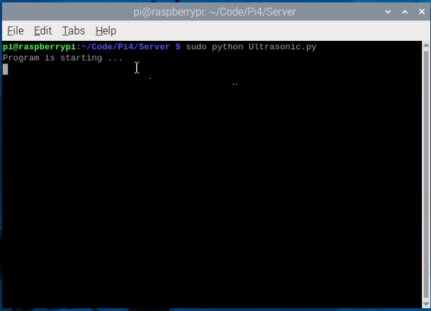

6.Ultrasonic Avoidance Car 
==========================

Description
------------

The obstacle avoidance function of the car mainly uses the HC-SR04 ultrasonic module. 
The ultrasonic module is controlled by the servo. The servo rotates to the left, 
middle and right repeatedly, so that the ultrasonic module measures the distance 
of obstacles on the left, middle and right directions. And then it controls the 
car to move according to different distances.

.. note:: 

    Before running the standalone program, make sure to shut down the main program 
    ccording to the following sections; otherwise, the standalone program will not 
    be able to start.
    :ref:`VNC`

Run program
------------   
1. You can jump to the project folder directly by running this command:
``cd /home/pi/Code/Pi4/Server``

2. Run Light.py:
``sudo python Ultrasonic.py``

You can press "Ctrl + C" to end the program

Details of the program
------------------------

.. code-block:: python
   :emphasize-lines: 2
   :linenos:
   
    class Ultrasonic:
    def __init__(self):
        GPIO.setwarnings(False)
        self.trigger_pin = 27
        self.echo_pin = 22
        self.MAX_DISTANCE = 300  # define the maximum measuring distance, unit: cm
        self.timeOut = self.MAX_DISTANCE * 60  # calculate timeout according to the maximum measuring distance
        GPIO.setmode(GPIO.BCM)
        GPIO.setup(self.trigger_pin, GPIO.OUT)
        GPIO.setup(self.echo_pin, GPIO.IN)

    def pulseIn(self, pin, level, timeOut):  # obtain pulse time of a pin under timeOut
        t0 = time.time()
        while (GPIO.input(pin) != level):
            if ((time.time() - t0) > timeOut * 0.000001):
                return 0
        t0 = time.time()
        while (GPIO.input(pin) == level):
            if ((time.time() - t0) > timeOut * 0.000001):
                return 0
        pulseTime = (time.time() - t0) * 1000000
        return pulseTime

    def get_distance(self):  # get the measurement results of ultrasonic module,with unit: cm
        distance_cm = [0, 0, 0, 0, 0]
        for i in range(5):
            GPIO.output(self.trigger_pin, GPIO.HIGH)  # make trigger_pin output 10us HIGH level  
            time.sleep(0.00001)  # 10us
            GPIO.output(self.trigger_pin, GPIO.LOW)  # make trigger_pin output LOW level
            pingTime = self.pulseIn(self.echo_pin, GPIO.HIGH, self.timeOut)  # read pulse time of echo_pin
            distance_cm[i] = pingTime * 340.0 / 2.0 / 10000.0  # calculate distance with sound speed 340m/s
        distance_cm = sorted(distance_cm)
        final_distance = distance_cm[2]  # Take the middle value after sorting
        # If measured value equals 0, convert to 255
        if final_distance == 0:
            final_distance = 255
        return int(final_distance)  # Return the processed integer distance value
    
    def run(self):
        self.PWM = Motor()
        while True:
            M = self.get_distance()
            if M <= 20:  # If obstacle is too close (<=20cm)
                self.PWM.setMotorModel(-1000, -1000, -1000, -1000)  # Move backward
                time.sleep(0.3)  
                if 50 >= random.randint(1, 100):  # Randomly choose turn direction
                    self.PWM.setMotorModel(-2000, -2000, 2000, 2000)  # Turn left
                else:
                    self.PWM.setMotorModel(2000, 2000, -2000, -2000)  # Turn right
                time.sleep(0.3)  
            elif 20 < M <= 30:  # If obstacle is at warning distance (20-30cm)
                self.PWM.setMotorModel(0, 0, 0, 0)  # Stop the car
                time.sleep(0.2)
                if 50 >= random.randint(1, 100):  # Randomly choose turn direction
                    self.PWM.setMotorModel(-2000, -2000, 2000, 2000)  # Turn left
                else:
                    self.PWM.setMotorModel(2000, 2000, -2000, -2000)  # Turn right
                time.sleep(0.3)
            else:  # If no obstacle detected (>30cm)
                self.PWM.setMotorModel(1000, 1000, 1000, 1000)  # Move forward

    ultrasonic = Ultrasonic()
    # Main program logic follows:
    if __name__ == '__main__':
    print('Program is starting ... ')
    try:
        ultrasonic.run()
    except KeyboardInterrupt:  # When 'Ctrl+C' is pressed, the child program destroy() will be executed.
        PWM.setMotorModel(0, 0, 0, 0)  # Stop the car when program is interrupted

Result Analysis:
----------------

The ultrasonic obstacle avoidance car detects obstacle distances through a single front ultrasonic sensor and performs different avoidance actions based on different distance ranges:

1. When detected distance > 30cm:
   - Indicates no obstacles within 30 centimeters in front
   - The car continues to move forward straight (setMotorModel(1000, 1000, 1000, 1000))

2. When detected distance ≤ 20cm:
   - Indicates obstacles are very close with risk of collision
   - The car first moves backward (setMotorModel(-1000, -1000, -1000, -1000))
   - Pauses for 0.3 seconds
   - Randomly chooses to turn left or right to find a new path
   - Continues turning motion for 0.3 seconds

3. When detected distance is between 20-30cm:
   - Indicates obstacles ahead but still at a safe distance
   - The car stops first (setMotorModel(0, 0, 0, 0))
   - Pauses for 0.2 seconds
   - Randomly chooses to turn left or right to find a new path
   - Continues turning motion for 0.3 seconds

Through this control strategy, the car can:
- Maintain forward movement within safe distances
- Avoid obstacles in time when encountered
- Explore new viable paths through random turning
- Effectively prevent collisions with obstacles