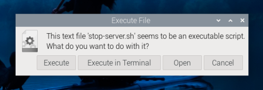
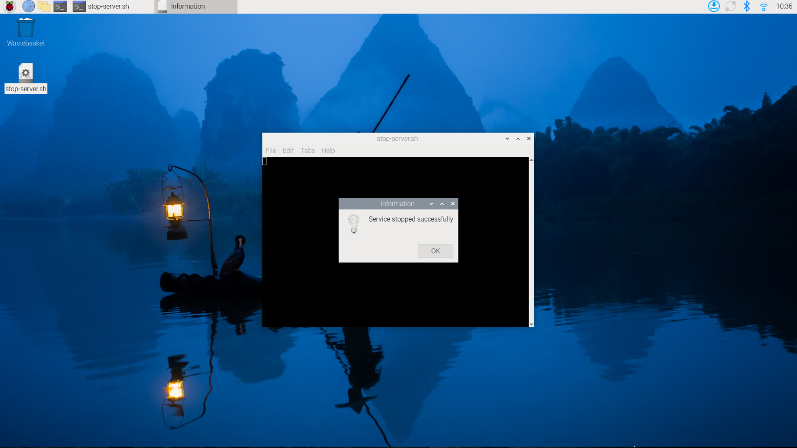

.. _VNC:

How to use VNC to access the Raspberry Pi Desktop
==================================================
Please ensure that you have followed the steps in Chapter One to correctly burn 
the system into your SD card, configure the correct WiFi, and assemble the car 
correctly according to the video.

If everything is confirmed to be ready, we will officially start the tutorial.

Firstly, insert the SD card, install the battery, and ensure the car is powered 
on.

Then, press the two buttons. Under normal circumstances, the two lights next to 
the buttons will light up, and the Raspberry Pi and OLED display will also light 
up. Wait for a while, and the screen will display the IP address, followed by a 
beep from the car's buzzer.

Step 1 Download VNC Software
------------------------------
You need to download and install the  `VNC viewer <https://www.realvnc.com/en/connect/download/viewer/>`_ on personal computer. After the 
installation is done, open it.

Step 2 Create new connection
------------------------------------
Then select “New connection”.

.. image:: ./img/RemoteDesktop_5.png

Step 3 Fill in the ip and name of the raspberry pi
------------------------------------------------------
Input IP address of Raspberry Pi and any Name.The IP here is from the car OLED

.. image:: ./img/RemoteDesktop_6.png

Step 4 Double-click to enter the Raspberry Pi GUI
-----------------------------------------------------
Double click the connection just created:

.. image:: ./img/RemoteDesktop_9.png

Step 5 Enter verification information
-----------------------------------------
Enter Username (pi) and Password(admin).

.. image:: ./img/RemoteDesktop_7.png

Step 6 Raspberry Pi Desktop
------------------------------------
Now you can see the desktop of the Raspberry Pi

.. image:: ./img/desktop1.png

.. image:: ./img/desktop2.png

At this point, we have successfully entered the Raspberry Pi system.

.. _test_Subroutine:

Test Subroutine
^^^^^^^^^^^^^^^^^^^^^^^^^^^^^

If you need to run the car's individual programs, you still need to follow these steps:

You can find the file stop-server.sh on your desktop

.. image:: img/desktop2.png

All you have to do is double-click on it and select ``Excute in Terminal`` in the pop-up window, wait for a while and you'll get the message ``Service stopped successfully``.

Then you can navigate to the folder ``cd /opt/Code/Pi4/Server`` or ``cd /opt/Code/Pi5/Server-pi5`` to find all the 
car's files, where you can run individual programs.

If you have finished testing and want to run the main program again, you can 
enter ``sudo systemctl start main-server.service`` in the terminal.

.. image:: ./img/turnon_main-server.png

Alternatively, you can press the two buttons on the car's mainboard to restart 
the car. The restart will automatically launch the car's main program, and then 
you can control the car with the app.

