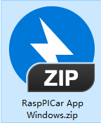
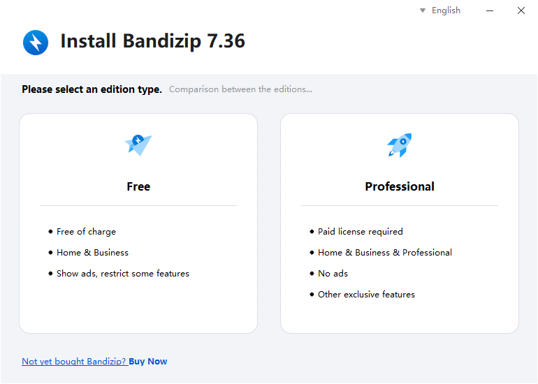
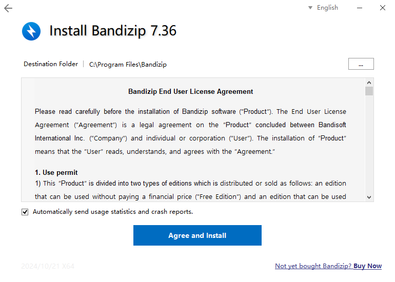
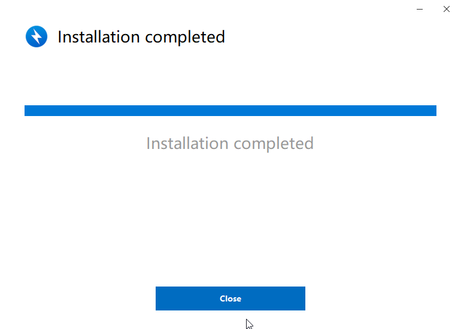
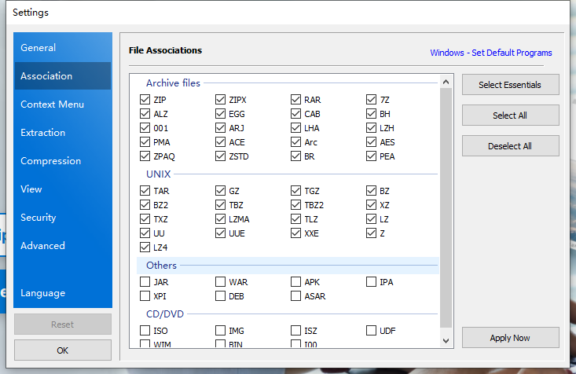
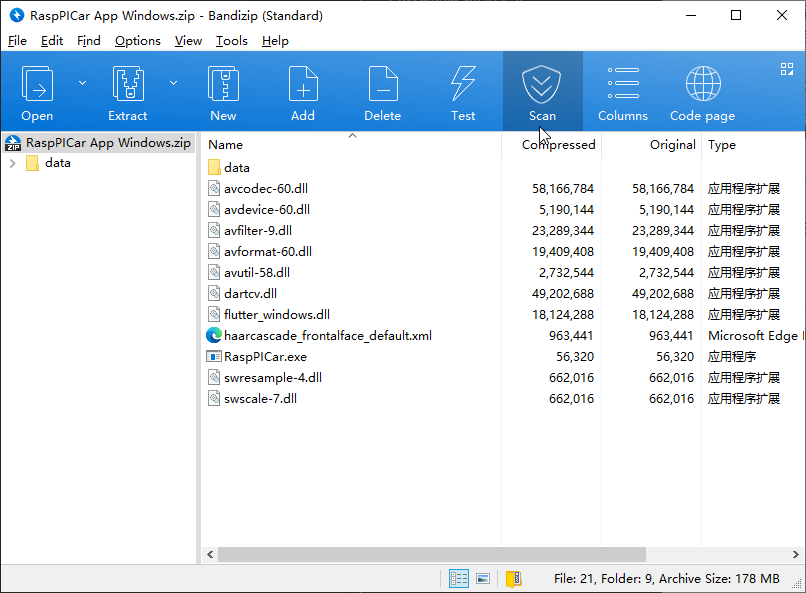
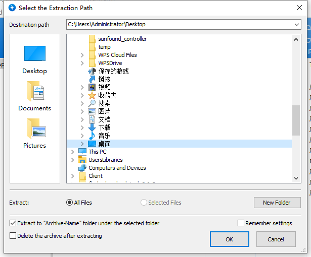
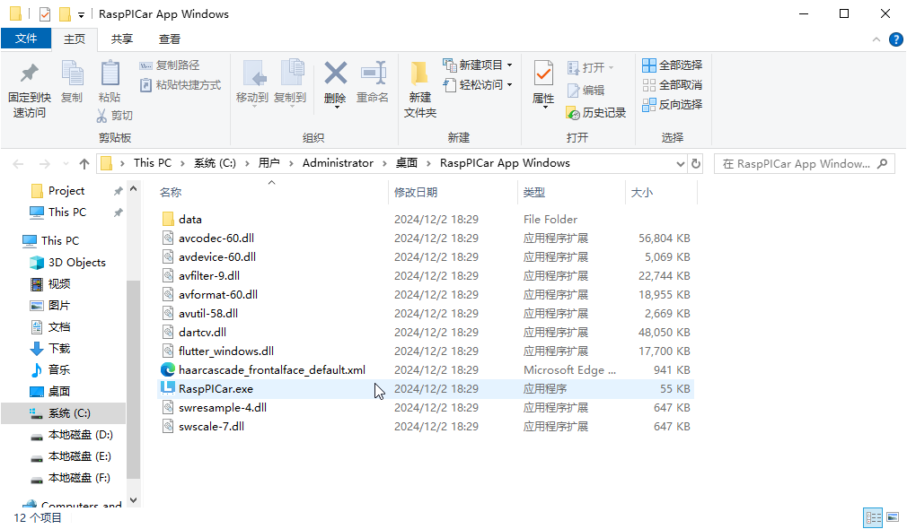

.. _unzip:

How to Unzip?
===============
When you click on the download link according to the tutorial, you will find that you have downloaded a zip compressed file.

We will teach you how to unzip it.

If you don't have compression software on your computer, you can download Bandizip from this link, which is a decompression software. If you have compression software on your computer, you can skip this step.

`Download Bandizip <https://en.bandisoft.com/bandizip/dl.php?web>`_

After downloading, click OK to complete the installation.

Windows
----------
This is the client for Windows. After downloading, when you open it with Bandizip, it looks like this.

You can click "Extract" to the location where you want to store the files. Here, I will place it on the desktop.

After that, we can find this folder on the desktop.

The Raspberry PI image file can also be extracted using bandzip.