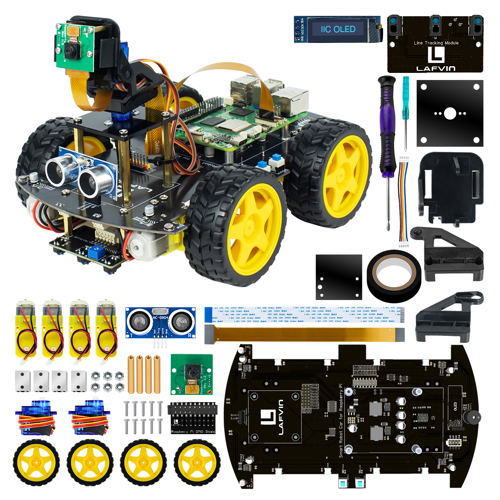

Component List
===================

.. list-table:: Bill of Materials (BOM)
   :header-rows: 1
   :widths: 5 35 10 50

   * - No.
     - Component Name
     - Qty
     - Description
   * - 1
     - Multifunctional Expansion Board
     - 1
     - Robot chassis integrated with PWM, buzzer, RGB LED, and light-sensitive sensor.
   * - 2
     - TT Motors and Wheels
     - 4
     - Drive motors and high-grip tires for car propulsion.
   * - 3
     - Raspberry Pi GPIO Shield
     - 1
     - Connects the Pi to the chassis; provides power regulation and data communication.
   * - 4
     - 5MP Wide-Angle Camera & Gimbal Kit
     - 1
     - Provides image acquisition with 2-DOF (Degree of Freedom) gimbal control.
   * - 5
     - Ultrasonic Sensor Module
     - 1
     - Used for distance measurement and autonomous obstacle avoidance.
   * - 6
     - SG90 Servo Pack
     - 2
     - Micro servos for controlling the horizontal and vertical movement of the gimbal.
   * - 7
     - 3-Channel Line Tracking Module
     - 1
     - Infrared sensor array for path following and line navigation.
   * - 8
     - 0.91-inch OLED Display
     - 1
     - Displays real-time status, IP address.
   * - 9
     - Screw & Standoff Fastener Pack
     - 1
     - Complete hardware set for structural assembly and component mounting.
   * - 10
     - XH2.54 5-Pin Cable (10cm)
     - 1
     - Used for internal signal connection and module interfacing.